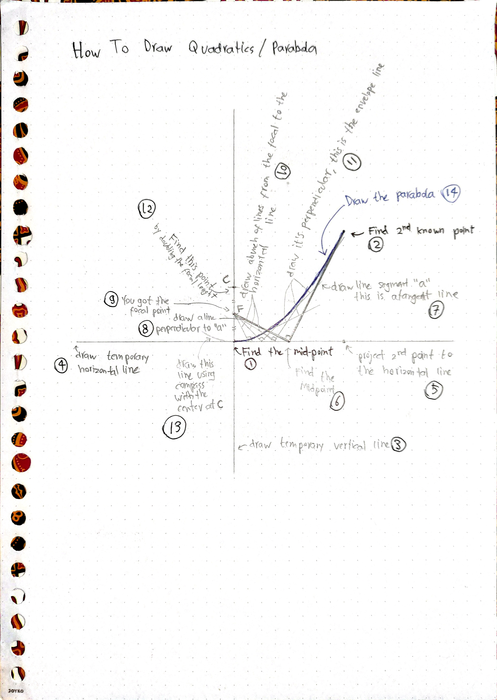

This method can be used to practically construct parabola in the real world without relying on manual cartesian calculation, or CNC, while still giving an excellent approximation. This is how to draw it:

