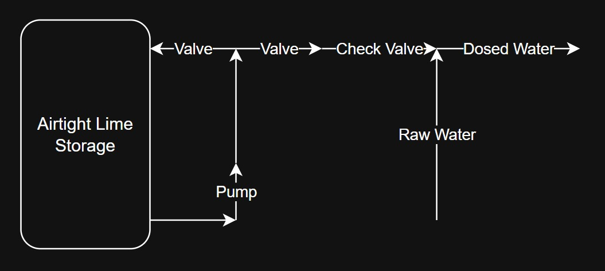
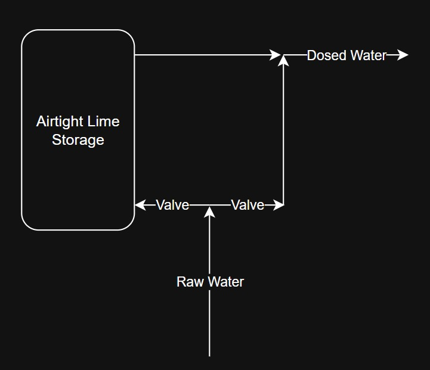

Using combinations of airtight lime container and pump as mixer, series of pipes and valves to adjust lime dose, also a pump to put the water into the tank.

# Preview
In order to simplify my process, I divided the system into 3 parts:
1. Lime storage + dose adjuster
2. Clarifier
3. Aerator + Water tank

# First Part
The first part is the lime storage and the dose adjuster. I need to buy an airtight lime container, pipes, and valves. The general arrangement is to store the lime in the airtight container and use water pump to keep the lime suspended. The pump will be installed externally and the pumped slurry piped in again. There also outward directed flow, where it will be used to dose raw water with lime slurry. Both flow direction have ball valve to adjust the dose.  

To make sure the first part work, we need to assemble just the first part and try running it. The diagram for the complete first part is as follow:

The Pump would be 22W 12V pump with flowrate of 800 L/h and maximum head of 5 m. This is to ensure that the pump is powerful enough to move the thick lime slurry. Thus the items needed to be bought for the first part is:
1. ~~Airtight Lime Storage~~ (Rp65.124K)
2. ~~22W 12V 5m 800L/s pump~~ (Rp109.35K)
3. ~~2x 1/2 inch inner diameter screw pipe~~ (~Rp5K)
4. ~~2x 1/2 inch outer diameter screw pipe~~ (~Rp10K)
5. ~~2x water tank hole to pipe adapter~~ (~Rp11.88K refer to  No. 3 for outer diameter)
6. ~~2x In line Ball Valve~~ (~Rp36.5K)
7. ~~2x T junction~~ (Rp6K)
8. ~~1x Inline Check valve~~ (Rp6.18K)
9. 1x 6m pipe

## 20250817

The first part should work in principle. However, in practice, the valve setting is too sensitive as to render dosing completely impractical. One of the reason is that the check valve reduce the pressure and its length alone cause significant lag in lime mixing downstream response. This is bad for automation, as response needs to wait a few tens of seconds before change in valve setting can be applied.

I've removed the check valve apparatus and directly connect ball valve output to Y branched and valved quick connect, to connect it to hose system. After connecting everything, the design works and the response is reasonably fast. I can get consistent optimum dosed lime output given input pressure. However, if the input pressure change, the setting will have to be readjusted. I have tried potential pressure independent system but the airtight lime storage needs to resist internal pressure, which my container failed to do.

## 20250919

The first part need raw water pipe to deliver from and clean water pipe to deliver to a water supply line. To do this, I will use HDPE pipe instead of PVC due to its cost, flexibility, and resistance to UV damage. I will buy:
1. 25m 1/2" HDPE pipe
2. 4x 1/2" HDPE pipe elbows
3. 4x 1/2" HDPE pipe to PVC pipe with outer thread
## 20251118

Due to wildly varying water pressure from the input water supply, the first part need to be redesigned. The input water will be split into two path that will combine again. Each of the paths' resistance can be adjusted to make sure the flow rate is correct. One of the flow path's route will goes through the airtight lime container to pick up the lime water. Because most of the flow resistance comes from minor loss (geometric/fully turbulent loss), the flow rate proportion is almost constant with respect to flowrate.

This modification will solve the varying inlet pressure problem. The modification is also not very hard, because it can use the same parts.

## 20251128
The modification do work and the valve setting is now much more consistent. One problem that arise from the modified setup is that it cannot mix the lime to keep it suspended. Eventually the lime will accumulate at the bottom and doesn't get consumed. It is strictly not a critical problem, but it will always leave some residual unused lime. Also I found out that at certain time, water pressure is not sufficient for operation. I also need water tank storage for a proper operation.

# Second Part

## 20250919

Together with pipe assembly, I also need to prepare water containers to do the clarifying. For the initial setup, I will use 5 containers, 4 for clarifying and one for temporary output container. The temporary output container will be connected to the output HDPE pipe temporarily before the aerator and water tank setup (third part) is ready. To be purchased:
1. 5 ~40cm diameter water containers
2. 4 ~10cm diameter water container

## 20251202
The second part performance is less than calculated. This is maybe because not enough carbonate sands has accumulate to help filter it out of water. I will let it be for a month of operation and if the accumulated carbonate is not enough, I will put carbonate sand manually.