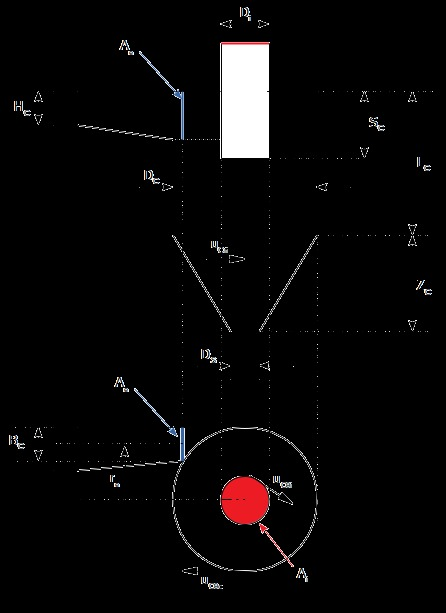

This cyclone specification can be used for home scale cement dust separator. With a diameter of 134mm, cyclone separator calculated using online excel module.
power available is 20 watt which is sufficient.

- Small particle filtering in using principle of terminal velocity, enough for 20 micrometer diameter particle. Using 200 mm diameter pipe with flow around 100 m3/hour just after grinding for separation.
- Cyclone body made out of 132 mm inner diameter pipe.
- Cone made out of modified same 132 inner diameter pipe
- Upper hole made of 60 mm inner diameter pipe.
- there is adapter for 60 mm to 4 inch fan
- the theoretical cut off size is 2 micrometer

More detailed information can be found in my [calculation spreadsheet](Cyclone_Design_Calculation_Tool_Simplified.xlsx).