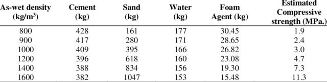

Wood stove made out of geopolymer foam. Geopolymer is fire resistance so naturally one of the application it can fit is a wood stove. With geopolymer, custom shape can be made with geopolymer because it is castable. Furthermore, foam can be introduced to geopolymer by using aluminum powder to increase insulation.
## Design
Geometric design of the wood stove is arbitrary. I have made wood stove design with reasonable hardness to make, but very safe and clean of smoke. It also use fan booster if needed.
[Woodstove Technical Drawing.pdf](woodstove-technical-drawing.pdf)

### 20251202
I will change the design to better redirect the flame into the cooking surface, by eliminating the slanted border (the one with 212.13 mm length) and adding partition that will force the flame to go up. I will move the smoke outlet down to lengthen the flame travel length, thus maximizing it's radiation emission inside the stove, before it went out. Total material will be roughly similar. 
## Material

Porosity is set to be around 800 to 1000 kg /m3. For OPC foamed concrete, the value we get is:
Cement: 409 kg
Sand: 395 kg
Water: 166 kg
Foam Agent: 26.82 kg

With that we get w/c = 0.4. That indeed would work for geopolymer with minimal segregation if the ratio is 0.3 for the cement, and the other 0.1 is given to the sand. The pore volume is around
$$\begin{align}
V &= 1\cdot \frac{1000}{2400}\text{ m}^3\\
V &= 0.417 \text{ m}^3
\end{align}$$
### Estimation
Adjusting for aluminum foam and geopolymer mix, we need a new calculation. With standard atmosphere, 0.417 m3 gas of hydrogen require 417/22.4 = 18.6 mole of hydrogen gas. With the reaction:

2Al + 2NaOH + 2H2O $\rightarrow$ 2Na3AlO2 + 3H2
Every 3 moles of hydrogen gas require 2 moles of aluminum atom and 2 moles of NaOH. Thus, we need about $18.6\cdot2/3=12.4$ moles of Al and NaOH each. 12.4 moles of Al have a mass of 335 gram. Cement paste needed for the mix is $409+0.3/0.4\cdot166=533.5$ kg. Thus, we need 496 gram additional NaOH for every 533.5 kg cement paste, or about 0.93 gram/kg.

|    Materials     | 1 m$^3$ [kg] | Unit Cost [IDR/kg] | Cost / 1 m$^3$ [IDR] | Cost / 0.21 m$^3$ [IDR] |
| :--------------: | -----------: | -----------------: | -------------------: | ----------------------: |
|   Cement Paste   |        549.5 |              20726 |             11389000 |                 2391800 |
|       Sand       |        406.9 |               1000 |               406900 |                   85449 |
| Additional Water |         42.7 |                  0 |                    0 |                       0 |
| Aluminium Powder |        0.345 |             260000 |                89700 |                   18837 |
| Additional NaOH  |        0.511 |              16000 |                 8176 |                    1717 |
|      Total       |         1000 |                  - |             11894000 |                 2497800 |

#### Wet Method
One of the method to make cement paste is the wet method. I requires already prepared sodium silicate solution and to be adjusted with NaOH or SiO2. The mix is given below for geopolymer of type Na-PSS (Na:Al = 1, Si:Al = 2).

| Paste Composition                                               | /1 kg Paste [kg] | Unit Price [IDR/kg] | Price [IDR] |
| --------------------------------------------------------------- | ---------------: | ------------------: | ----------: |
| Metakaolin                                                      |            0.264 |               35000 |        9240 |
| Filler (Calcined Kaolin)                                        |            0.264 |               35000 |        9240 |
| Sodium Silicate (4.25 M, SiO2:Na2O = 3.3) |            0.323 |               12000 |        3876 |
| Additional NaOH                                                 |            0.045 |               16000 |         720 |
| Additional Water                                                |            0.104 |                   0 |           0 |
| Total                                                           |                1 |                   - |       23076 |
#### Dry Method
Another way to make solution is using dry method. Dry method is done by preparing all the precursor dry, except for water. The mix is given below for geopolymer of type Na-PSS (Na:Al = 1, Si:Al = 2).

| Paste Composition        | /1 kg Paste [kg] | Unit Price [IDR/kg] | Price [IDR] |
| ------------------------ | ---------------: | ------------------: | ----------: |
| Metakaolin               |            0.264 |               28000 |        7392 |
| Filler (Calcined Kaolin) |            0.264 |               35000 |        9240 |
| NaOH                     |            0.095 |               16000 |        1520 |
| SiO2                     |            0.143 |               18000 |        2574 |
| Water                    |            0.234 |                   0 |           0 |
| Total                    |                1 |                   - |       20726 |

### Experimental Mix Design
With that being calculated, we need to write the experimental mix design to approximate initial mix. I designed an experiment using 1-inch pipe for the mold with inner diameter of 22.3 mm. I set the height of the sample to be 50mm. In total, around 20 grams of total material is needed for a single cast. I will make 5 mix with each mix having 5 duplicates, giving total of 25 sample to be casted. Below are the table for mix designs estimated each mix design.

| Materials        | Mix 1  | Mix 2  | Mix 3  | Mix 4  | Mix 5  | Total   | Unit Price [IDR/g] | Price [IDR] |
| ---------------- | ------ | ------ | ------ | ------ | ------ | ------- | ------------------ | ----------- |
| Cement Paste     | 53.655 | 53.655 | 53.655 | 40.241 | 40.241 | 241.446 | 15                 | 3622        |
| Sand             | 39.731 | 39.731 | 39.731 | 52.974 | 29.798 | 201.965 | 1                  | 202         |
| Additional Water | 4.169  | 4.169  | 4.169  | 4.169  | 4.169  | 20.847  | 0                  | 0           |
| Aluminium Powder | 0.034  | 0.025  | 0.045  | 0.034  | 0.034  | 0.171   | 260                | 45          |
| Additional NaOH  | 0.050  | 0.037  | 0.067  | 0.050  | 0.050  | 0.254   | 16                 | 4           |
| Total            |        |        |        |        |        |         |                    | 3872        |

