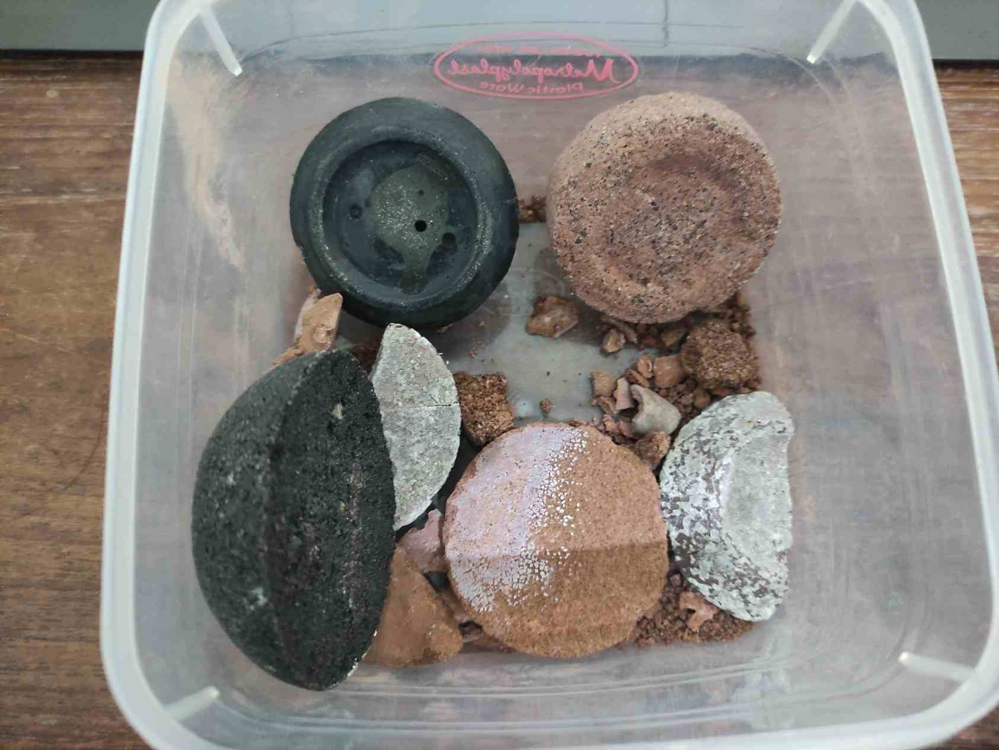

# Geopolymer
## Intro
It's a fascinating polymer consisted of inorganic monomers that is fire resistant, heat resistant, acid and base resistant, yet as strong as regular portland cement. It has way less water and pores than the portland cement, just because geopolymer is made by polymerization, not hydration. It consumes far less $\operatorname{CO_2}$. It is maintained by the [geopolymer institute](https://www.geopolymer.org).

It has the potential to compete or even replace the traditional portland cement.

## Precursor
There are a numberof precursors available to synthesize geopolymer. The main factor determining the success of geopolymerization is the dissolution rate and mineral type.

For clays, there are 3 main categories of them:
1. Kaolinite
2. Illite
3. Smectite

The most ideal precursor is the kaolinite. One way to test if a clay is kaolinite or not is to measure it's density, if it's around 2.7, most likely it is a kaolin clay.

## Result
Use of kaolinite proven to be most reliable. Two mix was made using kaolinite from weathered andesite site in Gondang, Bojonegoro and sediment of weathered volcaniclast, pumice, and volcanic ash in Beji, Depok. Size of grains matter a lot. first batch from Gondang was not sieved and it result in moderate strength geopolymer. Metakaolin sieved with no. 300 sieve proven to be highly reactive, good consistency and strong final product.

Below is my personal trial result. The black sample is the geopolymer made from Beji, Depok clay deposit. The orange one was made from Gondang, Bojonegoro. The other things are just failed trials using marl instead of kaolinite-rich deposit. See also my [Instagram Highlight]([Stories • Instagram](https://www.instagram.com/stories/highlights/17903956835635943/)) of the trials.

## What Exactly are Geopolymers?
They usually refer to a class of synthetic mineral created using "geopolymerization" method, particularly using aluminosilicate minerals. But that's just because that particular synthetic mineral is very useful in making stuff that is almost identical to Portland Concrete.

But truly what are geopolymers? To understand it deeply we can take a detour to the mind of a geopolymer chemist. Geopolymer chemistry is a novel approach on how we study minerals and their reactions. The first realization of this approach was the synthesis of polysiloxane (silicone), a polymer made out of silicon backbone with various organic functional group attached to it's side. If we think about it, it's actually pretty crazy. Silicon is the main constituent of rocks on earth crust. Rocks are known for it's hard and brittle nature, yet silicone, is squishy and quite flexible. So what gives?

Silicon oxygen silicon bond (siloxane) is very stable, thus any chance it can form, it will form. Because silicon have 4 valences it can form four siloxane bonds. The only stable bond of 4 siloxanes given the radius of silicon and oxygen is tetrahedral or cubic. Tetrahedral network is rigid because it has low degree of freedom in molecular movement. Thus quartz, the pure form of the network is hard a material. Just like carbon if in diamond form.

A pedant would say that technically siloxane is Si-O-Si bond that have organic ground attached to it (organosilicon). But that's the point of geopolymer chemistry, viewing functional group or bond as it is, not as a side molecules that is attached to a carbon. Because according to geopolymer science, it is better to say that the side molecules are actually the organic ones, the main molecules of interest here is silicon.

If you, by some chemistry wizardry can bind two molecules to two of the valence bonds of silicon, so that the bond become stable and inert, then you can make chain of molecules out of it. Because it is a chain, it has more molecular degree of freedom to move. Thus silicone is squishy. The thing is, hydrogen attached to a carbon valence makes it relatively inert, so it doesn't bond to other carbon as easily. So carbon can from long chain just by binding two of it's valence to hydrogen, and yeah that makes it a hydrocarbon.

And here's come the realization. At what number of siloxanes bond a silicon atom have to make a polymer? Clearly 4 is not because it is a quartz after all, it is not a polymer. It's hard and brittle unlike any polymers that's squishy and deformable. We also know that 2 is the number of siloxanes in silicone, so clearly it is a polymer. So somewhere between 2 and 4. Some would say 3, 3.5 or thereabouts. But, someone argues, what if quartz itself is a polymer? That might sounds audacious, but if we think about it, what exclude quartz from polymer category, aside from its lack of carbon, and physical properties? None, there is not a single criteria excluding it. It is a macromolecule constituted of repeating SiO2 unit, or stated clearly it is a crystal. If a crystal is an exclusion for polymer, then fused quartz is a polymer because it's amorphous. Remember, we don't care physical properties, we are talking about chemistry here.

There's no escape, siloxane is the same bond in silicone as in silica, and both are polymer. It doesn't matter if it's organic or not. But, to make it different, we can give silicate materials (quartz, glass, clays, etc.) a different name. Because most of silicate is geologic in origin, we might, name it, geologic polymer, or even, geopolymers!