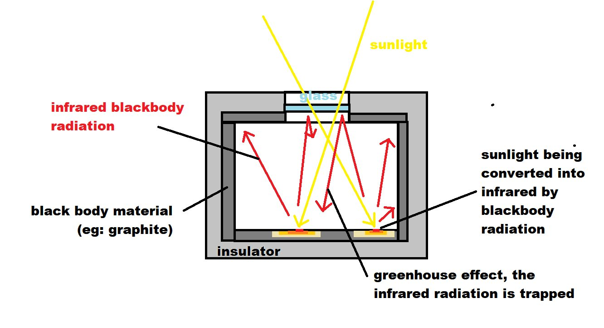
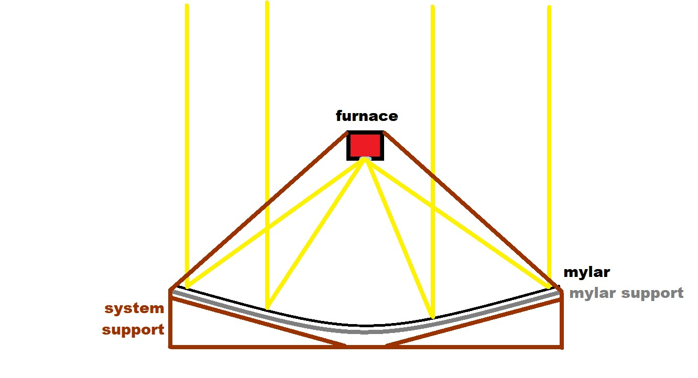
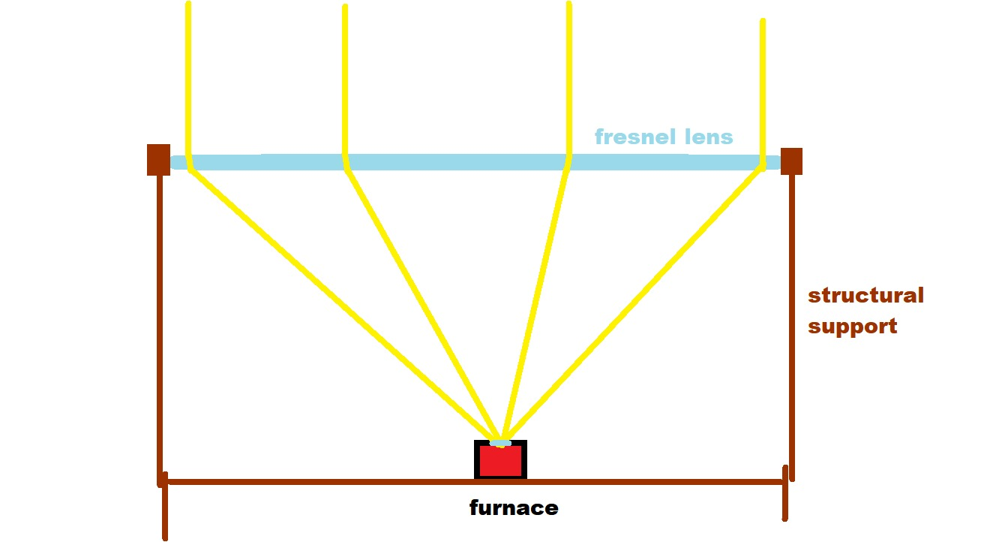

# Mini Solar Furnace
## Intro
The idea came when I consider the power of sun versus typical electric kiln. Turned out typical small electric kiln in amazon pulls about 1.5kWatt of power. It is known that solar irradiance is 1.3kWatt on earth. Thus, by utilising the power of 1 sq meter of sunlight, we should be able to have similar furnace capacity.

The design is focusing on how to trap sunlight into a room. My first instict was to use glass as a one way trip for the majority of the solar irradiance. This can be achieved if we put blackbody radiator behind the glass inside the furnace. See the illustration below:

However I quickly realized that the glass will not be able to whitstand such temperature. So, I proposed that I should use quartz glass. Also, in order to be able to collect the sunlight into the furnace, I need a sun collector. It can be mirror, or lens. The most realistic case for mirror based collection is to use mylar blanket and shape it with some kind of sructural support. The lens option however will need the use of huge fresnel lens.

## Components, by routes:
1. Mirror
	1. mylar blanket or something similar $1 m^2$
		1. [Jual Emergency Blanket - Lembaran - Jakarta Pusat - NATURE -Native Adventure | Tokopedia](https://www.tokopedia.com/nature-drybag/emergency-blanket-lembaran?src=topads)
		2. [Jual emergency blanket 160x210cm - Jakarta Utara - dpeakoutdoor | Tokopedia](https://www.tokopedia.com/dpeak-outdoor/emergency-blanket-160x210cm) 
	2. sturctural support for the mylar mirror--aspirationally--parabolic shape. can be made out of metal plates, plywood, etc.
	3. structural support for the whole mirror, and the furnace
2. Lens
	1. fresnel lens $1 m^2$
		1. [1010x1010mm $150](https://szhaiwang.en.made-in-china.com/product/GBNElZodGjcq/China-Big-Solar-Line-Concentrated-Fresnel-Lens.html)
		2. [1000x1000mm $320](https://www.alibaba.com/product-detail/PMMA-Material-1-Meter-Large-Fresnel_60772062957.html?spm=a2700.shop_plgr.41413.9.382939d4usax7M)
	2. structural suppor for the lens and the furnace

## Design:
### Mirror
Going with the mirror design requires minor modification on the furnace schematics. It need to be flipped down. This is because in the mirror design, the light came from the bottom. It has the advantages of the bottom heave. This will cost less parts in the overall structural support. Howerver, it has the disadvantages of being made of mylar, which is not very durable material. Moreover, the mylar mirror support will add quite a challange for design and fabrication.

### Lens
The lens design have the advantages of being simpler to make. But it can be potentially far more expensive. This is because I don't know the price of large fresnel lens, and the last time i see it, it was very expensive. We also need structural support that have to extend all the way up to the focal place of the lens.

## The Furnace
As stated earlier, the principle work of the furnace is to trap heat as much as needed. Here are the components required:
1. Refractory Insulator & structure
	1. [geopolymer](/geopolymer/)
	2. Fire Brick & Steel Plate
		1. [230x114x65mm Rp22380](https://www.tokopedia.com/rahullaputra/bata-tahan-api-sk-36-std)
	3. AAC Block & Steel Plate
2. Black Body Material
	1. Graphite
		1. [100x100mm Rp89k](https://www.tokopedia.com/fxsm/elektroda-pelat-batang-karbon-graphite-plate-electrode-100x100x2mm)
	2. Heat resistant dark paint
3. Quartz Glass
	1. [$11.29 27.9×4.1 mm | eBay](https://www.ebay.com/itm/333243171426?hash=item4d96d74262:g:QMoAAOSwMv5dDg1T)
	2. [$15.38 34 ×5mm | eBay](https://www.ebay.com/itm/113812936385?hash=item1a7fc796c1:g:bBEAAOSwNMJiKY0U)
	3. [14.29 37 ×7 mm | eBay](https://www.ebay.com/itm/233281220208?hash=item3650a4ee70:g:XlEAAOSwJTddIgy0)
	4. [Startnow Laser Protective Lens Silica Windows HIGHYAG Raytools 37x7 For Trumpf Bystronic Fiber Laser Cutting Equipment Window|Lensa| - AliExpress](https://id.aliexpress.com/item/4000432780777.html?spm=a2g0o.productlist.0.0.3f2a2177ag4To3&algo_pvid=15503922-9155-4326-b771-006df1fe6a5f&algo_exp_id=15503922-9155-4326-b771-006df1fe6a5f-38&pdp_ext_f=%7B%22sku_id%22%3A%2210000002285198803%22%7D&pdp_pi=-1%3B3.7%3B-1%3B-1%40salePrice%3BUSD%3Bsearch-mainSearch)
	5. [Ultrarayc Laser Protective Windows 21.5×2/30×5/37×7mm Optical Lens for Precitec Procuttor & Lightcutter& SolidCutter 0 18kW Head|Lensa| - AliExpress](https://id.aliexpress.com/item/4001013339862.html?spm=a2g0o.productlist.0.0.3f2a2177ag4To3&algo_pvid=15503922-9155-4326-b771-006df1fe6a5f&aem_p4p_detail=202203141113502049485056423800043273975&algo_exp_id=15503922-9155-4326-b771-006df1fe6a5f-49&pdp_ext_f=%7B%22sku_id%22%3A%2210000013516218759%22%7D&pdp_pi=-1%3B3.35%3B-1%3B-1%40salePrice%3BUSD%3Bsearch-mainSearch)

## Extra
An electrically controlled temperature regulator can be implemented with the addition of shades. If the temperature are too high, then the regulator will tell the shades to move in and vice versa.

## Uses
The Furnace can be used to make calcinate kaolin in order to make [geopolymer](/geopolymer/). This  furnace in a way is the most efficient form of furnace. Other alternative includes electric kiln, which consume electricicty, that ultimately came from the sun, which should be far less than 20% efficient. Another one is solar energy, which have efficiency of about 20-30%. With solar panel, you would need $5 m^2$  in order to have the same power as this design.