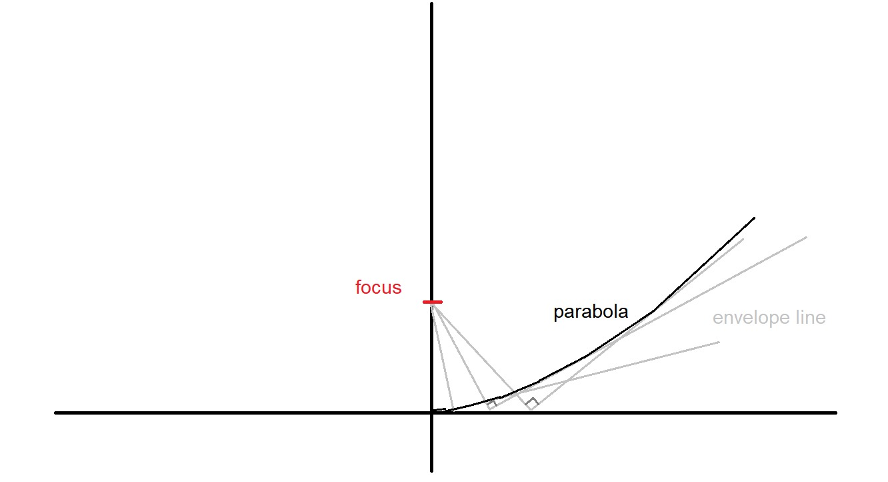

# Parabolic Mold
## Intro
Parabola is the ideal shape to collect parallel rays of light. It is thus the best shape for solar concentrator. However, it is hard to manufacture. In this note, I have an idea to make parabolic mold with plywood. In short, a parabolic mold consist of plywoods and mortar that is shaped by a mold maker. The mold maker is made out of two parabloic curve joined as a cross and stabilized by a hollow circle with inner diameter as the desired diameter. 

## The parabolic curve
The 2d parabolic curve can be made easily wih the "[draw-parabola-using-ruler-and-compass](/draw-parabola-using-ruler-and-compass/)" method, provided there is a ruler. Short illustration can be seen below:

## Mold Maker
After the two curves and a circle with desired focal length and width is made, then I can proceed to make the mold maker. For rough illustration, can be seen below:

## How to use it
Fill inside of the mold maker a mold ingredient, can be mortar, resin, or anything that can be shaped with rotating plywood. Rotate as shown here. The mold will be formed

